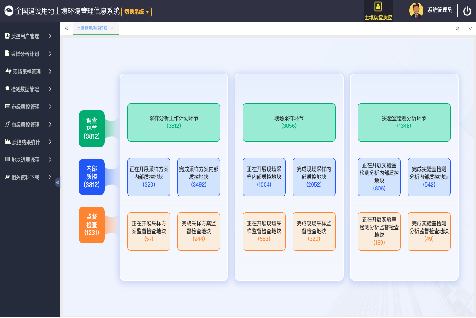
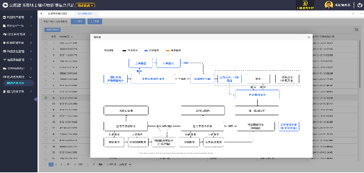
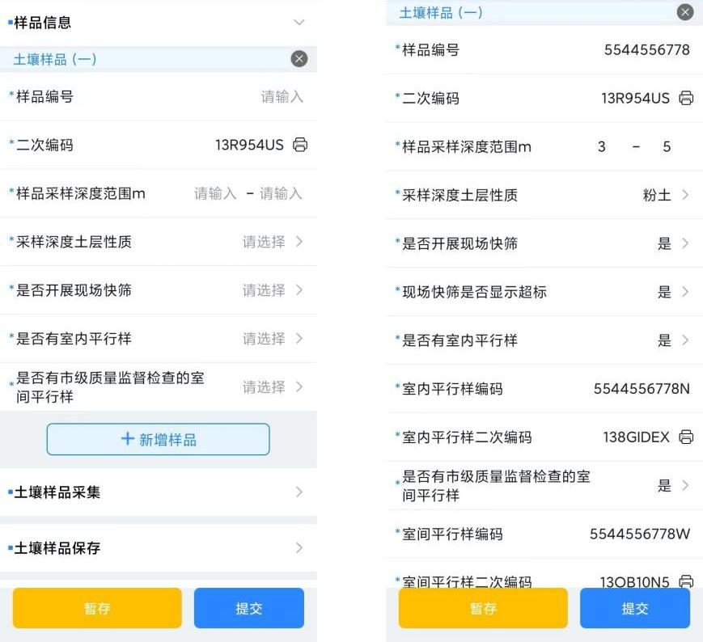

# 智慧环保-土壤调查采样质控系统

#### 介绍
智慧环保-土壤调查采样质控系统
系统简介：为进一步加强建设用地土壤污染状况调查工作的质量管理，通过建设用地土壤污染状况调查与质控系统，实现建设用地第二阶段土壤污染状况调查 的制定采样分析工作计划、现场采样、实验室检测分析的内外部质量控制信息和报告编制的外部质量控制信息等工作。
使用部门：国家、省、市、县各级环保部门
主要成效：通过调查质控系统，4千多地块完成了数据的录入，以及近2万多名调查用户的信息管理；支撑了4千多用户开展初步调查工作，极大支持了土壤污染状况调查阶段关键环节的信息化管理工作。

商务合作 WeChat: 2609375767
#### 软件架构
软件架构说明

前端：vue

后台：spring-boot

#### 系统截图
1. 登录页

   
2.首页

3. 采样APP

4. 采样APP

